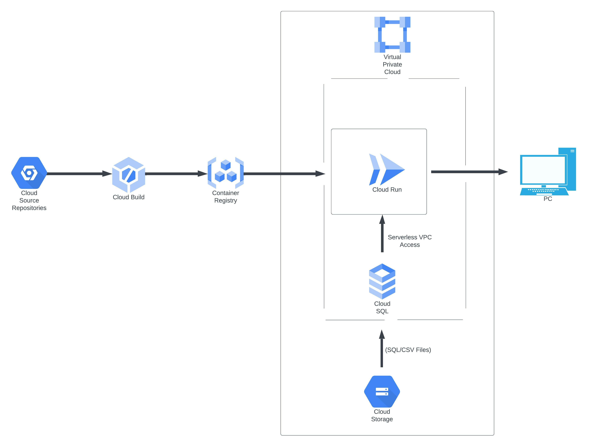

# The Challenge 1

  

A 3-tier environment is a common setup. Use a tool of your choosing/familiarity create these
resources. Please remember we will not be judged on the outcome but more focusing on the
approach, style and reproducibility.

  

## Approach I followed

  

Here I have assumed that the source code for the application to be deployed to the Google Cloud Run has been hosted in the Cloud Source Repository. And using the Google Cloud Build for CI/CD.
Similarly I am using the Terraform to deploy the infrastructure, as shown in the architecture diagram.

### Code flow to be deployed to Cloud Run

The source code from the Cloud Source Repository will be taken into the Google Cloud Build triggers and then the built intermediate container images will be saved to the Google Container Registry. From the Google Container registry, the container image will be deployed to the Cloud Run service.
The Cloud Run service will be connected to the Cloud SQL over the Serverless VPC Access, the Cloud SQL should be created with the private IP address assignment.

### Code to deploy the the GCP Infrastructure

The source code to deploy the GCP infra will also be hosted to the Cloud Source repository.
Respective Cloud Build Triggers will be created to deploy the resource to the Google Cloud.

  

# Required GCP Resources

 1. VPC
 2. Serverless VPC Access Connector
 3. Cloud SQL
 4. GCS Bucket
 5. Cloud Run Service